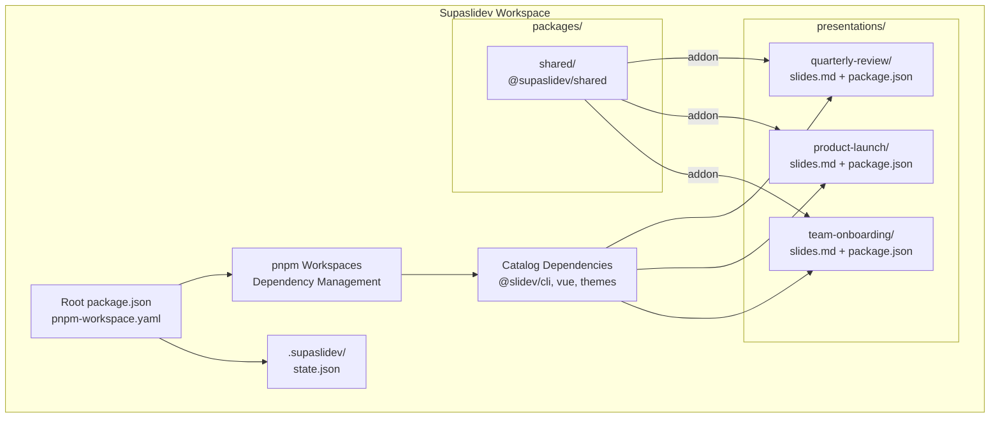

## Why a Monorepo?

Managing presentations as separate projects creates friction:

- **Duplicated effort**: Installing dependencies, configuring tools, and updating versions happens per-project
- **Version inconsistency**: Different presentations end up on different Slidev versions, leading to subtle bugs and incompatibilities
- **Scattered tooling**: No central place to run commands across all presentations

A monorepo consolidates everything into a single repository while keeping presentations independent. You get shared infrastructure without coupling your content.

## Architecture Overview

The following diagram shows how a Supaslidev workspace is structured:


```mermaid
graph TB
    subgraph Workspace["Supaslidev Workspace"]
        Root["Root package.json<br/>pnpm-workspace.yaml"]

        PNPM["pnpm Workspaces<br/>Dependency Management"]

        subgraph Packages["packages/"]
            Shared["shared/<br/>@supaslidev/shared"]
        end

        subgraph Presentations["presentations/"]
            P1["quarterly-review/<br/>slides.md + package.json"]
            P2["product-launch/<br/>slides.md + package.json"]
            P3["team-onboarding/<br/>slides.md + package.json"]
        end

        Catalog["Catalog Dependencies<br/>@slidev/cli, vue, themes"]
        State[".supaslidev/<br/>state.json"]
    end

    Root --> PNPM
    PNPM --> Catalog
    Catalog --> P1
    Catalog --> P2
    Catalog --> P3
    Shared -->|addon| P1
    Shared -->|addon| P2
    Shared -->|addon| P3
    Root --> State
```

## Benefits of This Approach

### Shared Dependencies

All presentations share a single `node_modules` at the workspace root. pnpm's content-addressable storage ensures packages are only stored once on disk, even across hundreds of presentations.

### Consistent Tooling

Linting, formatting, and build configurations live in one place. When you update a tool, all presentations benefit immediately.

### Atomic Updates

Upgrading Slidev happens once in the catalog. Every presentation gets the new version on the next `pnpm install`, reducing the risk of forgotten or partially-updated projects.

### Simplified CI/CD

One repository means one pipeline. Build and deploy any combination of presentations from a single workflow.

## pnpm Workspace Configuration

The workspace is defined in `pnpm-workspace.yaml` at the repository root:

```yaml
packages:
  - 'packages/*'
  - 'presentations/*'

catalog:
  '@slidev/cli': ^52.11.3
  '@slidev/theme-default': latest
  '@slidev/theme-seriph': latest
  'vue': ^3.5.26
```

### The packages Array

The `packages` array tells pnpm which directories contain workspace packages. The glob `packages/*` includes shared packages like `@supaslidev/shared`, while `presentations/*` includes every presentation folder as a separate package.

When you create a new presentation with `pnpm new my-talk`, it becomes part of the workspace automatically and is pre-configured to use the shared package as a Slidev addon.

### Understanding Catalog Dependencies

The `catalog` section is the key to consistent versioning. It defines named versions that presentations reference using the special `catalog:` specifier.

In a presentation's `package.json`:

```json
{
  "dependencies": {
    "@slidev/cli": "catalog:",
    "@slidev/theme-default": "catalog:",
    "@supaslidev/shared": "workspace:*",
    "vue": "catalog:"
  }
}
```

When pnpm resolves `"@slidev/cli": "catalog:"`, it looks up `@slidev/cli` in the workspace catalog and uses that version (`^52.11.3`). The `"workspace:*"` specifier links to the local shared package. This creates a single source of truth for dependency versions.

### Updating Catalog Versions

To upgrade Slidev across all presentations:

1. Edit `pnpm-workspace.yaml`:

```yaml
catalog:
  '@slidev/cli': ^53.0.0 # Updated version
```

2. Run `pnpm install` to apply the change:

```bash
pnpm install
```

Every presentation now uses the new version. The lockfile updates to reflect the change, and you can verify everything works before committing.

## Running Commands Across the Workspace

pnpm provides built-in filtering to run commands across multiple packages without additional tools.

### Build All Packages

The root `package.json` includes a `build` script:

```bash
pnpm build
```

This runs `pnpm --filter @supaslidev/* run build`, building all workspace packages.

### Filter by Package

Run commands on specific packages or patterns:

```bash
# Build every presentation
pnpm --filter '@supaslidev/*' run build

# Build a specific presentation
pnpm --filter @supaslidev/my-talk run build

# Build presentations matching a pattern
pnpm --filter '@supaslidev/quarterly-*' run build
```

### Workspace Scripts

The root `package.json` provides convenience scripts:

```bash
pnpm dev              # Start the interactive dashboard
pnpm new <name>       # Create a new presentation
pnpm present <name>   # Start dev server for one presentation
pnpm export <name>    # Export presentation to PDF
pnpm deploy           # Build all presentations for deployment
pnpm build            # Build all workspace packages
```

::callout{type="tip" icon="i-heroicons-light-bulb"}
You can optionally add [Turborepo](https://turbo.build/) to your workspace for intelligent caching and parallel task execution. Add a `turbo.json` to your workspace root to configure task dependencies and caching behavior.
::

## Adding Presentations

Create a new presentation using the dashboard CLI:

```bash
pnpm new my-new-talk
```

This command:

1. Creates `presentations/my-new-talk/` with the standard structure
2. Generates a `package.json` using catalog dependencies
3. Creates a starter `slides.md` file
4. Runs `pnpm install` to link the new package

You can also create presentations manually. Create the folder structure and ensure the `package.json` uses `catalog:` and `workspace:` specifiers:

```bash
mkdir -p presentations/manual-talk
```

```json
{
  "name": "@supaslidev/manual-talk",
  "private": true,
  "type": "module",
  "scripts": {
    "build": "slidev build",
    "dev": "slidev --open",
    "export": "slidev export"
  },
  "dependencies": {
    "@slidev/cli": "catalog:",
    "@slidev/theme-default": "catalog:",
    "@supaslidev/shared": "workspace:*",
    "vue": "catalog:"
  }
}
```

Don't forget to add the shared addon to your `slides.md` frontmatter:

```yaml
---
addons:
  - '@supaslidev/shared'
---
```

Then run `pnpm install` to add it to the workspace.

## Removing Presentations

To remove a presentation from the workspace:

1. Delete the presentation folder:

```bash
rm -rf presentations/old-talk
```

2. Clean up the lockfile:

```bash
pnpm install
```

pnpm automatically removes the package from the workspace and updates `pnpm-lock.yaml`.

If you want to archive a presentation without deleting it, move it outside the `presentations/` directory. Since it no longer matches the workspace glob, pnpm treats it as a regular folder.

## Workspace Structure Recap

A typical Supaslidev workspace looks like this:

```
my-workspace/
├── packages/
│   └── shared/              # Shared components, layouts, styles
│       ├── components/
│       ├── layouts/
│       ├── styles/
│       └── package.json     # Configured as Slidev addon
├── presentations/
│   ├── quarterly-review/
│   │   ├── slides.md
│   │   └── package.json     # Uses catalog: and workspace: dependencies
│   ├── product-launch/
│   │   ├── slides.md
│   │   └── package.json
│   └── team-onboarding/
│       ├── slides.md
│       └── package.json
├── .supaslidev/
│   └── state.json           # Workspace metadata
├── pnpm-workspace.yaml      # Workspace config and catalog
├── package.json             # Root package
└── pnpm-lock.yaml           # Single lockfile for all packages
```

Key points:

- Each presentation is a separate pnpm package with its own `package.json`
- All presentations share dependencies through the catalog
- The shared package provides reusable components, layouts, and styles across all presentations
- A single `pnpm-lock.yaml` locks versions for the entire workspace
- The `.supaslidev/` folder tracks workspace state for migrations

## Next Steps

Learn more about the [CLI commands](/reference/cli-commands) for managing presentations, or explore the [dashboard features](/features/dashboard) for an interactive workflow.
